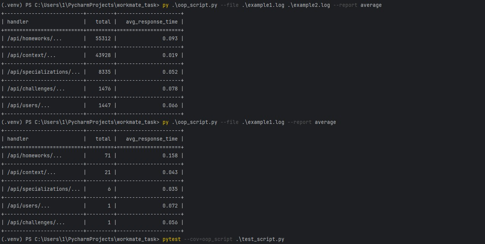
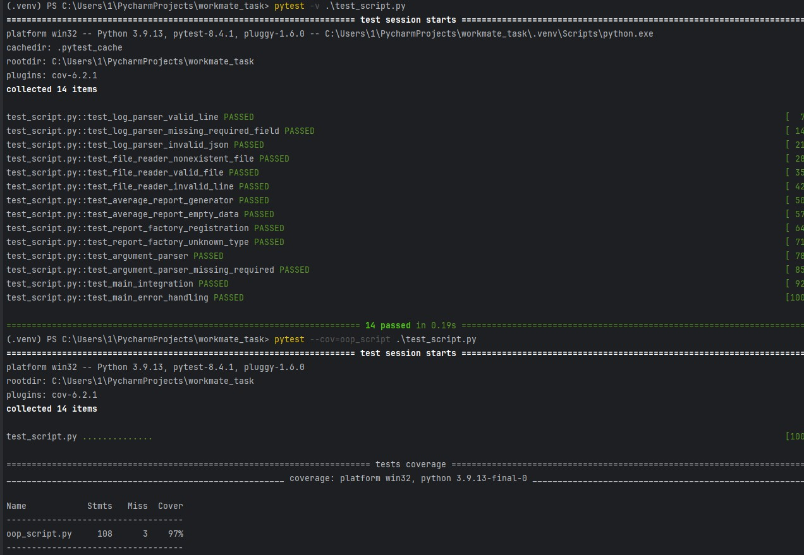

Сначала было реализовано задание с использованием функций, затем оно было переписано в ООП, а после к нему добавлены тесты. Проверенной и итоговой версией сккрипта является oop_script.py

## Примеры запуска

## Запуск тестов

